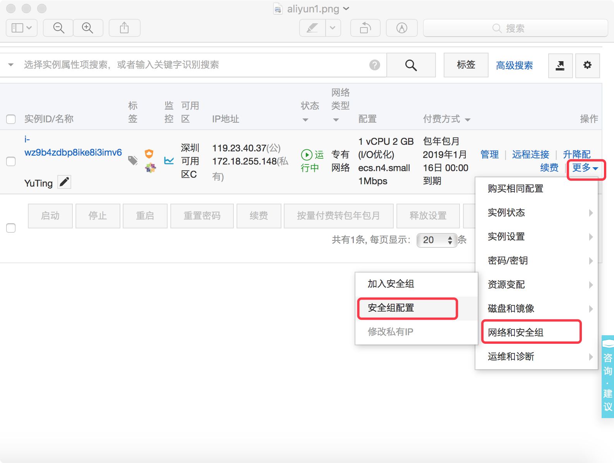
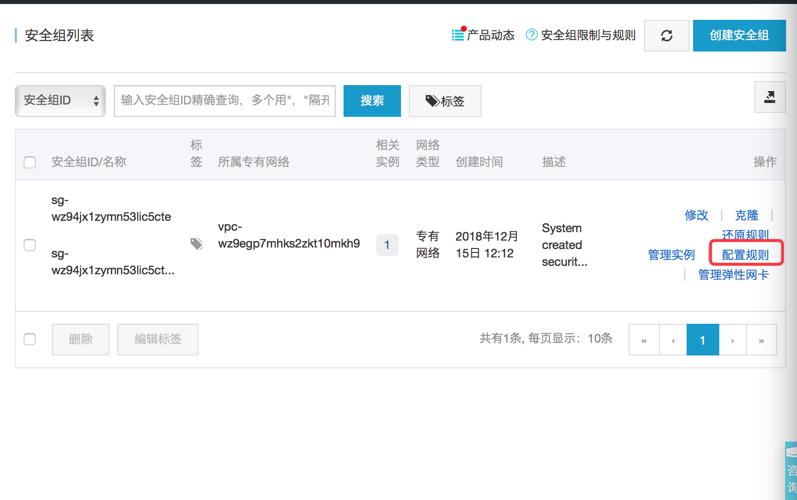
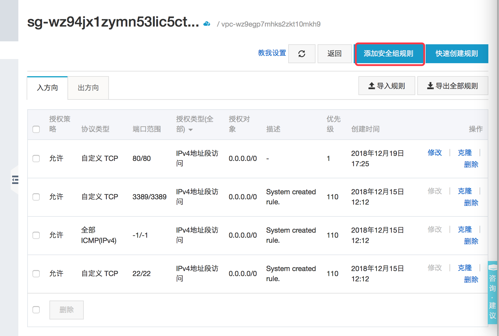
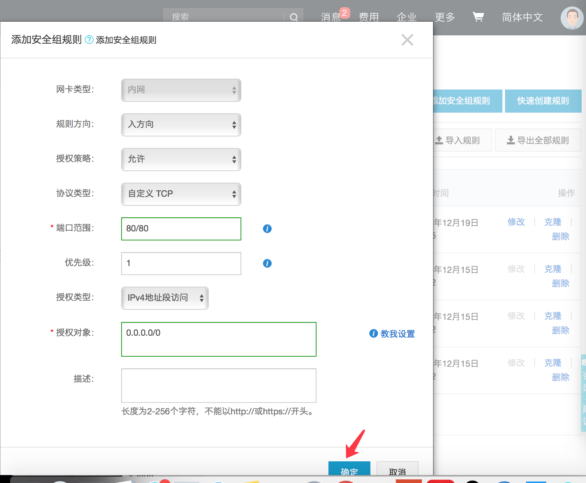

# Nginx服务器
### 1.阿里云添加80端口
阿里云上默认只有一个22端口用来做远程登录，如果希望在阿里云上安装支持http请求的nginx服务器，需要给阿里云添加80端口

  





### 2. 安装nginx

a) 添加nginx存储库  

```python
	yum install epel-release
```
 
b) 安装nginx

```python
	yum install nginx
```  
c) 运行nginx  
Nginx不会自行启动。要运行Nginx  

```
	systemctl start nginx
```  

nginx的运行命令:  

```
	systemctl status nginx 查看nginx的状态  
	systemctl start/stop/enable/disable nginx 启动/关闭/设置开机启动/禁止开机启动  
```   

d) 系统启动时启动Nginx  

```
	systemctl enable nginx
```   

e）如果您正在运行防火墙，请运行以下命令以允许HTTP和HTTPS通信：   

```
	sudo firewall-cmd --permanent --zone=public --add-service=http 

	sudo firewall-cmd --permanent --zone=public --add-service=https

	sudo firewall-cmd --reload
```  


### 3.nginx目录共享配置  
a) 在contOS目录中确定一个需要共享的文件夹，例如： /home/yuting  
b) 打开 etc/nginx/nginx.conf 文件，设置server

```
	#共享设置 - 在浏览器中输入服务器ip地址，会展示共享目录的文件列表
	root /home/yuting;
	location / {
	       autoindex on;
	       autoindex_exact_size on;
	       autoindex_localtime on;
	}  
```

除了可以共享文件，还可以自定义页面

```
	#自定义服务器页面
	location / {
			root /home/yuting;
			index index.html index.htm;
	}
```

注意： 如果出现权限问题，可以修改目录的权限  

# ssh密钥认证  
1.在主机和从机上执行：`ssh-keygen`

2.在从机上执行:  `scp  id_rsa.pub  root@主机地址:~/.ssh/master.pub`
(上面这条指令是将从机上的 id_rsa.pub文件拷贝传递给到主机的.ssh文件夹下，并且命名为’master.pub’)

3.在主机中的.ssh文件夹中创建authorized_keys文件： `touch authorized_keys` 

4.修改文件authorized_keys的权限: `chmod 600  authorized_keys`  

5.将master.pub放进authorized_keys文件中:  `cat master.pub >>  authorized_keys`

6.在操作主机的时候，需要主机能够自己免密访问自己就将自己的公钥放在自己的authorized_keys文件中


